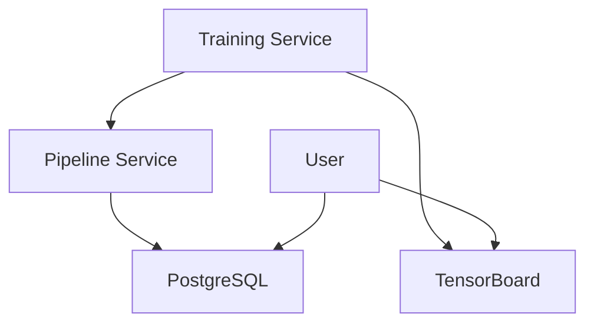

# AlphaRL-Quant Deployment Guide

**Production-Grade Reinforcement Learning for Algorithmic Trading**

This guide covers deploying AlphaRL-Quant locally, via Docker, andCloud platforms (AWS/GCP).

---

## 📋 Table of Contents

- [Quick Start](#-quick-start)
- [Prerequisites](#-prerequisites)
- [Local Deployment](#-local-deployment)
- [Docker Deployment](#-docker-deployment)
- [Training the Agent](#-training-the-agent)
- [Monitoring & Visualization](#-monitoring--visualization)
- [Cloud Deployment](#-cloud-deployment)
- [Troubleshooting](#-troubleshooting)
- [Production Checklist](#-production-checklist)

---

## 🚀 Quick Start

### Option A: One-Command Docker Deploy (Recommended)

```bash
# Clone and deploy
git clone https://github.com/Rushabh333/AlphaRL-Quant.git
cd AlphaRL-Quant
bash deploy.sh
```

**That's it!** Services will be available at:
- 📊 TensorBoard: http://localhost:6006
- 🗄️  PostgreSQL: localhost:5432

### Option B: Local Python

```bash
bash scripts/deploy_local.sh
```

### Option C: Manual Docker

```bash
docker-compose up -d
```

---

## 📦 Prerequisites

### System Requirements
- **RAM**: 8GB minimum, 16GB recommended
- **Storage**: 10GB free space
- **CPU**: 4+ cores recommended
- **GPU**: Optional (10x faster training with NVIDIA GPU)

### Software Dependencies

#### For Local Deployment:
```bash
# macOS
brew install python@3.10 postgresql ta-lib

# Ubuntu/Debian
sudo apt-get install python3.10 python3-pip postgresql libta-lib0 libta-lib-dev

# Verify Python version
python3 --version  # Should be 3.10+
```

#### For Docker Deployment:
- [Docker Desktop](https://www.docker.com/products/docker-desktop) (includes Docker Compose)
- For GPU: [NVIDIA Container Toolkit](https://docs.nvidia.com/datacenter/cloud-native/container-toolkit/install-guide.html)

### API Access
- **Yahoo Finance**: No API key required (free tier has rate limits)
- **Optional**: PostgreSQL database (included in Docker setup)

---

## 💻 Local Deployment

### Step 1: Clone Repository
```bash
git clone https://github.com/Rushabh333/AlphaRL-Quant.git
cd AlphaRL-Quant
```

### Step 2: Configure Environment
```bash
# Copy environment template
cp .env.example .env

# Edit with your settings
nano .env
```

**Required variables:**
```env
DB_PASSWORD=your_secure_password  # For PostgreSQL
```

### Step 3: Run Deployment Script
```bash
bash scripts/deploy_local.sh
```

This script will:
- ✅ Check Python 3.10+
- ✅ Create virtual environment
- ✅ Install dependencies
- ✅ Initialize directory structure
- ✅ Run data pipeline

### Step 4: Verify Installation
```bash
# Check processed data
ls -lh data/processed/

# View logs
tail -f logs/pipeline.log

# Activate venv (if needed)
source .venv/bin/activate
```

---

## 🐳 Docker Deployment

### Step 1: Install Docker
- **macOS/Windows**: [Docker Desktop](https://www.docker.com/products/docker-desktop)
- **Linux**: Follow [official guide](https://docs.docker.com/engine/install/)

### Step 2: Configure Environment
```bash
cp .env.example .env
# Edit .env with your DB_PASSWORD
```

### Step 3: Deploy with Docker
```bash
bash scripts/deploy_docker.sh
```

**Or use the one-command script:**
```bash
bash deploy.sh
```

### Step 4: Verify Services
```bash
# Check service status
docker-compose ps

# View logs
docker-compose logs -f

# Test TensorBoard
curl http://localhost:6006
```

### Docker Service Architecture



**Services:**
- `postgres`: Data storage
- `pipeline`: Data collection & feature engineering
- `training`: RL agent training (CPU mode)
- `training-gpu`: RL agent training (GPU mode)
- `tensorboard`: Training visualization

---

## 🎓 Training the Agent

### Local Training
```bash
# Activate virtual environment
source .venv/bin/activate

# Train for 10K steps (quick test)
python src/training/train_agent.py

# Monitor in another terminal
tensorboard --logdir=./logs/tensorboard/
```

### Docker Training (CPU)
```bash
docker-compose --profile training up training
```

### Docker Training (GPU)
**Prerequisites:**
```bash
# Install NVIDIA Container Toolkit
distribution=$(. /etc/os-release;echo $ID$VERSION_ID)
curl -s -L https://nvidia.github.io/nvidia-docker/gpgkey | sudo apt-key add -
curl -s -L https://nvidia.github.io/nvidia-docker/$distribution/nvidia-docker.list | sudo tee /etc/apt/sources.list.d/nvidia-docker.list
sudo apt-get update && sudo apt-get install -y nvidia-container-toolkit
sudo systemctl restart docker
```

**Run training:**
```bash
docker-compose --profile gpu up training-gpu
```

### Training Configuration

Edit `config/config.yaml`:
```yaml
training:
  total_timesteps: 1000000  # 1M for production
  learning_rate: 0.0003
  batch_size: 64
```

Or use custom config:
```python
from src.config import AlphaRLConfig

config = AlphaRLConfig()
config.training.total_timesteps = 2_000_000
config.save_yaml('config/custom.yaml')
```

---

## 📊 Monitoring & Visualization

### TensorBoard

**Local:**
```bash
tensorboard --logdir=./logs/tensorboard/ --port=6006
# Visit http://localhost:6006
```

**Docker:**
```bash
# TensorBoard starts automatically with docker-compose
# Access at http://localhost:6006
```

**Metrics to Monitor:**
- `ep_rew_mean`: Average episode reward (should increase)
- `loss/policy_loss`: Policy network loss
- `loss/value_loss`: Value network loss
- `explained_variance`: Model fit quality (closer to 1 is better)

### Logs

```bash
# Pipeline logs
tail -f logs/pipeline.log

# Training logs
tail -f logs/training_1m.log

# Docker logs
docker-compose logs -f [service-name]
```

### Database Queries

```bash
# Connect to database
psql -h localhost -p 5432 -U postgres -d trading_db

# View pipeline runs
SELECT * FROM pipeline_runs ORDER BY start_time DESC LIMIT 10;

# View model checkpoints
SELECT model_name, timestep, mean_reward, sharpe_ratio 
FROM model_checkpoints 
ORDER BY mean_reward DESC;
```

---

## ☁️ Cloud Deployment

### AWS (Amazon Web Services)

#### Option 1: EC2 Deployment

**Instance Requirements:**
- `t3.xlarge` (4 vCPU, 16GB RAM) for CPU training
- `g4dn.xlarge` (4 vCPU, 16GB RAM, T4 GPU) for GPU training

**Steps:**
```bash
# 1. Launch EC2 instance (Ubuntu 22.04 LTS)

# 2. SSH into instance
ssh -i your-key.pem ubuntu@<instance-ip>

#3. Install Docker
curl -fsSL https://get.docker.com -o get-docker.sh
sudo sh get-docker.sh
sudo usermod -aG docker ubuntu

# 4. Clone and deploy
git clone https://github.com/Rushabh333/AlphaRL-Quant.git
cd AlphaRL-Quant
bash deploy.sh
```

**Cost Estimate:**
- t3.xlarge: ~$120/month (on-demand)
- g4dn.xlarge: ~$350/month (on-demand)
- Use Spot Instances for 70% savings

#### Option 2: ECS (Elastic Container Service)

```bash
# Build and push to ECR
aws ecr create-repository --repository-name alpharl-quant
docker build -t alpharl-quant .
docker tag alpharl-quant:latest <account-id>.dkr.ecr.<region>.amazonaws.com/alpharl-quant:latest
docker push <account-id>.dkr.ecr.<region>.amazonaws.com/alpharl-quant:latest

# Create ECS task definition (use docker-compose.yml as reference)
# Deploy via AWS Console or CLI
```

### GCP (Google Cloud Platform)

#### Option 1: Compute Engine

```bash
# Create VM instance
gcloud compute instances create alpharl-quant \
  --machine-type=n1-standard-4 \
  --boot-disk-size=50GB \
  --image-family=ubuntu-2204-lts \
  --image-project=ubuntu-os-cloud

# SSH and deploy
gcloud compute ssh alpharl-quant
git clone https://github.com/Rushabh333/AlphaRL-Quant.git
cd AlphaRL-Quant
bash deploy.sh
```

#### Option 2: Cloud Run (Serverless)

```bash
# Build container
gcloud builds submit --tag gcr.io/<project-id>/alpharl-quant

# Deploy to Cloud Run
gcloud run deploy alpharl-quant \
  --image gcr.io/<project-id>/alpharl-quant \
  --platform managed \
  --region us-central1 \
  --memory 4Gi
```

**Cost Estimate (GCP):**
- n1-standard-4: ~$140/month
- With GPU (T4): ~$300/month additional

---

## 🔧 Troubleshooting

### Common Issues

#### 1. Tests Failing
```bash
# Install package in editable mode
pip install -e .

# Run tests
pytest tests/ -v
```

#### 2. Docker Build Fails
```bash
# Clear Docker cache
docker system prune -a

# Rebuild without cache
docker-compose build --no-cache
```

#### 3. PostgreSQL Connection Error
```bash
# Check if PostgreSQL is running
docker-compose ps postgres

# Check logs
docker-compose logs postgres

# Verify DB_PASSWORD in .env
cat .env | grep DB_PASSWORD
```

#### 4. Out of Memory During Training
```bash
# Reduce batch size in config
training:
  batch_size: 32  # Down from 64
```

#### 5. GPU Not Detected
```bash
# Verify NVIDIA driver
nvidia-smi

# Check Docker GPU support
docker run --rm --gpus all nvidia/cuda:11.8.0-base-ubuntu22.04 nvidia-smi
```

### Log File Locations

| Component | Log Path |
|-----------|----------|
| Pipeline | `logs/pipeline.log` |
| Training | `logs/training_1m.log` |
| TensorBoard | `logs/tensorboard/` |
| Docker | `docker-compose logs` |

### Debug Mode

```bash
# Enable debug logging
export LOG_LEVEL=DEBUG

# Run with verbose output
python scripts/run_pipeline.py --verbose
```

---

## ✅ Production Checklist

Before deploying to production:

### Code Quality
- [ ] All tests passing (`pytest tests/`)
- [ ] No debug print statements
- [ ] Code formatted (`black src/ tests/`)
- [ ] Linting passed (`flake8 src/`)
- [ ] Type checking passed (`mypy src/`)

### Configuration
- [ ] Strong DB password set
- [ ] Environment variables configured
- [ ] Logging configured for production
- [ ] Resource limits set (Docker)

### Data
- [ ] Sufficient historical data collected
- [ ] Feature engineering tested
- [ ] Data validation passing

### Infrastructure
- [ ] Database backups configured
- [ ] Monitoring set up (Prometheus/Grafana)
- [ ] Alerts configured
- [ ] SSL/TLS for external connections

### Security
- [ ] Secrets not in code/Docker image
- [ ] Non-root user in containers
- [ ] Firewall rules configured
- [ ] Dependency vulnerability scan passed

### Performance
- [ ] Tested with production data volume
- [ ] Training completes in acceptable time
- [ ] Resource usage monitored

---

## 📚 Additional Resources

- [README.md](README.md) - Project overview and metrics
- [ARCHITECTURE.md](ARCHITECTURE.md) - System architecture
- [CONTRIBUTING.md](CONTRIBUTING.md) - Development guidelines
- [RL_GUIDE.md](RL_GUIDE.md) - RL concepts and training guide

---

## 🆘 Support

- **Issues**: [GitHub Issues](https://github.com/Rushabh333/AlphaRL-Quant/issues)
- **Discussions**: [GitHub Discussions](https://github.com/Rushabh333/AlphaRL-Quant/discussions)

---

**Built with ❤️ for quantitative trading research**

*Disclaimer: This is a research project. Not financial advice.*
