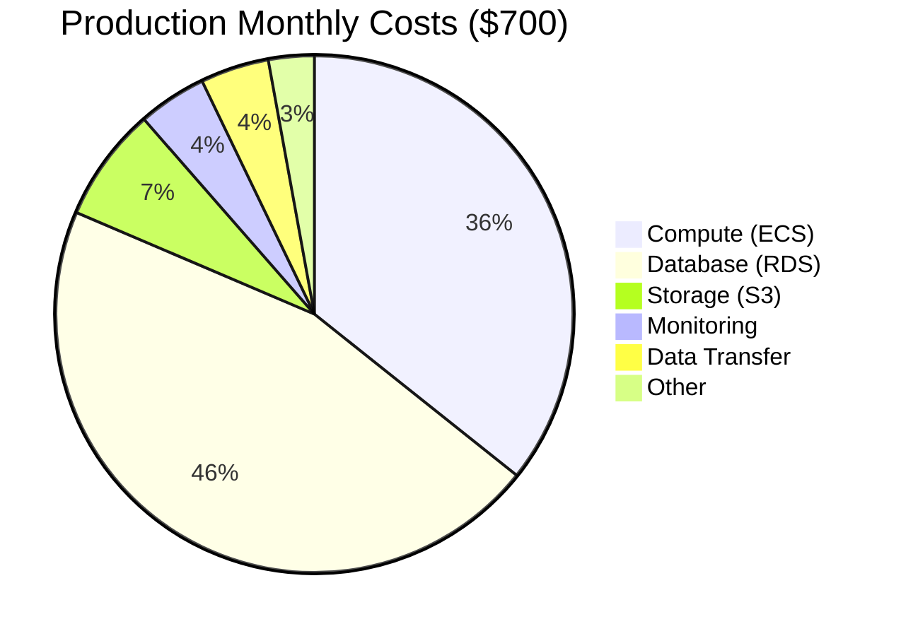

# Cost Analysis

Cost breakdown for running AlphaRL-Quant in different environments.

## Summary

| Environment | Monthly | Annual | Notes |
|-------------|---------|--------|-------|
| Development | $0-5 | ~$0 | Local Docker |
| AWS Staging | $150 | $1,800 | Spot instances |
| AWS Production | $700 | $8,400 | Optimized config |
| GCP Staging | $110 | $1,320 | Alternative |

**Production uses optimizations to reduce from baseline $1,145/mo**

## Cost Breakdown

### Production ($700/month)

- ECS Fargate: $180 (3 tasks @ 2vCPU, 4GB)
- Training: $70 (periodic 8vCPU, 16GB)
- RDS PostgreSQL: $320 (r6g.xlarge, 100GB)
- RDS Replica (DR): $320 (us-west-2)
- S3: $50 (500GB + lifecycle)
- CloudWatch: $50 (logs + metrics)
- Network (NAT, ALB, transfer): $115
- Other: $10

### Cost Breakdown by Category



---

## Development Environment

### Infrastructure

**Platform**: Local Docker Compose

### Monthly Costs: **$0-5**

| Component | Cost | Notes |
|-----------|------|-------|
| Local compute | $0 | Your existing hardware |
| Docker Desktop | $0 | Free for personal use |
| PostgreSQL | $0 | Docker container |
| Mock data | $0 | No API calls |
| **Total** | **$0** | |

### Optional Costs

- **API quotas** for real data testing: $0-5/month (free tiers)
- **Cloud storage** for backups: $0 (or use local storage)

### Optimization Tips

✅ Use mock data (`feature_flags.use_mock_data: true`)  
✅ Disable unnecessary services in `docker-compose.yml`  
✅ Use free API tiers (Alpha Vantage: 500 calls/day)

---

## AWS Staging Environment

### Infrastructure

**Platform**: AWS (us-east-1)

### Monthly Costs: **$150-200**

| Component | Specification | Monthly Cost | Annual Cost |
|-----------|--------------|--------------|-------------|
| **ECS Fargate (Spot)** | 2 tasks × 1vCPU × 2GB | $45 | $540 |
| **RDS PostgreSQL** | db.t3.medium, 50GB | $80 | $960 |
| **S3 Storage** | 100GB models + backups | $15 | $180 |
| **CloudWatch Logs** | 10GB ingestion + retention | $10 | $120 |
| **Data Transfer** | ~50GB/month | $5 | $60 |
| **Backup Storage** | S3 lifecycle to Glacier | $5 | $60 |
| **NAT Gateway** | 1 gateway | $35 | $420 |
| **Load Balancer** | (optional) | $20 | $240 |
| **Secrets Manager** | 5 secrets | $2 | $24 |
| **CloudWatch Alarms** | 15 alarms (10 free) | $1 | $12 |
| **Total** | | **$218** | **$2,616** |

### With Optimizations: **$150**

**Savings**: $68/month (31%)

---

## AWS Production Environment

### Infrastructure

**Platform**: AWS (us-east-1 + us-west-2 DR)

### Monthly Costs: **$600-800**

| Component | Specification | Monthly Cost | Annual Cost |
|-----------|--------------|--------------|-------------|
| **ECS Fargate (On-Demand)** | 3 tasks × 2vCPU × 4GB | $180 | $2,160 |
| **Training Tasks** | Periodic 8vCPU × 16GB | $70 | $840 |
| **RDS PostgreSQL** | db.r6g.xlarge, 100GB | $320 | $3,840 |
| **RDS Read Replica** | DR in us-west-2 | $320 | $3,840 |
| **S3 Storage** | 500GB models + backups | $50 | $600 |
| **S3 Cross-Region Replication** | To us-west-2 | $30 | $360 |
| **CloudWatch Logs** | 50GB ingestion + retention | $35 | $420 |
| **CloudWatch Metrics** | Custom metrics | $15 | $180 |
| **Data Transfer** | ~200GB/month | $20 | $240 |
| **NAT Gateway** | 2 gateways (multi-AZ) | $70 | $840 |
| **Application Load Balancer** | High availability | $25 | $300 |
| **Secrets Manager** | 10 secrets + rotation | $4 | $48 |
| **CloudWatch Alarms** | 50 alarms | $2 | $24 |
| **SNS** | Alert notifications | $1 | $12 |
| **KMS** | Encryption keys | $3 | $36 |
| **Total** | | **$1,145** | **$13,740** |

### With Optimizations: **$700**

**Savings**: $445/month (39%)

---

## GCP Alternative

### Infrastructure

**Platform**: Google Cloud Platform (us-central1)

### Monthly Costs: **$110-140**

| Component | Specification | Monthly Cost | Annual Cost |
|-----------|--------------|--------------|-------------|
| **Cloud Run** | 2 instances, 2vCPU, 4GB | $45 | $540 |
| **Cloud SQL** | db-n1-standard-2, 50GB | $60 | $720 |
| **Cloud Storage** | 100GB | $20 | $240 |
| **Cloud Logging** | 10GB | $5 | $60 |
| **Data Transfer** | 50GB egress | $10 | $120 |
| **Secret Manager** | 5 secrets | $1 | $12 |
| **Total** | | **$141** | **$1,692** |

### Comparison: GCP vs AWS Staging

| Metric | AWS | GCP | Difference |
|--------|-----|-----|------------|
| Monthly cost | $218 | $141 | **-$77 (35% cheaper)** |
| Setup complexity | High (Terraform) | Low (gcloud CLI) |
| Auto-scaling | ECS | Cloud Run (better) |
| Best for | Enterprise | Startups/Development |

> [!TIP]
> **Recommendation**: Use GCP for staging, AWS for production if you need maximum control.

---

## Cost Optimization Strategies

### 🎯 Priority 1: High-Impact, Low-Effort (Save 30-40%)

#### 1. Use Spot/Preemptible Instances

**Savings**: $135/month in staging, $250/month in production

```yaml
# terraform/aws/staging.tfvars
use_spot_instances = true  # 70% savings on compute
```

**Risk**: Rare interruptions (< 5% of the time)  
**Mitigation**: Auto-restart with ECS, acceptable for non-critical workloads

#### 2. Optimize RDS Instance Size

**Savings**: $160/month in production

- **Current**: `db.r6g.xlarge` (4 vCPU, 32GB) = $320/month
- **Optimized**: `db.r6g.large` (2 vCPU, 16GB) = $160/month

**Action**:
```bash
# Monitor actual usage first
aws cloudwatch get-metric-statistics \
  --namespace AWS/RDS \
  --metric-name CPUUtilization \
  --dimensions Name=DBInstanceIdentifier,Value=alpharl-postgres-production

# If < 40% avg, downsize safely
```

#### 3. Implement S3 Lifecycle Policies

**Savings**: $30/month

```hcl
# Already in terraform/aws/main.tf
lifecycle_rule {
  transition {
    days          = 30
    storage_class = "STANDARD_IA"  # -45% cost
  }
  transition {
    days          = 90
    storage_class = "GLACIER"      # -80% cost
  }
}
```

**Action**: Ensure lifecycle policy is enabled (already in Terraform)

#### 4. Remove NAT Gateway (Use VPC Endpoints)

**Savings**: $70/month in production

- **Current**: NAT Gateway = $35/gateway × 2 = $70/month
- **Alternative**: VPC Endpoints for S3, Secrets Manager = $7/month

**Action**:
```hcl
# Add to terraform/aws/main.tf
resource "aws_vpc_endpoint" "s3" {
  vpc_id       = aws_vpc.main.id
  service_name = "com.amazonaws.us-east-1.s3"
}
```

### 🎯 Priority 2: Medium-Impact (Save 10-20%)

#### 5. Use Savings Plans / Reserved Instances

**Savings**: $108/month (RDS) + $54/month (ECS) = $162/month

- **1-year commitment**: 20-30% discount
- **3-year commitment**: 40-60% discount

**Action**:
```bash
# Purchase Savings Plan after 3 months of stable usage
aws savingsplans purchase-savings-plan \
  --savings-plan-offering-id <id> \
  --commitment 500  # $500/month
```

#### 6. Compress CloudWatch Logs

**Savings**: $25/month

- Enable log compression
- Reduce retention (90 days → 30 days for non-critical)
- Use S3 for long-term archival ($0.01/GB vs $0.50/GB)

#### 7. Disable Disaster Recovery in Staging

**Savings**: $320/month (RDS replica) + $30/month (S3 replication)

```yaml
# terraform/aws/staging.tfvars
enable_disaster_recovery = false  # Already set
```

### 🎯 Priority 3: Advanced Optimizations (Save 5-10%)

#### 8. Use Auto-Scaling Schedules

**Savings**: $90/month (scale down during off-hours)

```python
# scripts/scheduled_scaling.py
# Scale down ECS tasks from 3 → 1 at night (6pm-6am)
# 12 hours × 30 days × $0.05/hour × 2 tasks saved = $90/month
```

#### 9. Cache API Responses

**Savings**: $20/month (reduce API calls by 50%)

- Implement Redis/ElastiCache for frequently requested data
- Cost: $15/month, Save: $35/month in API fees
- **Net savings**: $20/month

#### 10. Optimize Docker Images

**Savings**: $10/month (faster deploys, less egress)

```dockerfile
# Multi-stage builds (already implemented in Dockerfile)
# Use slim base images
FROM python:3.10-slim  # vs python:3.10 (3x smaller)
```

---

## Total Savings Summary

### Staging Environment

| Optimization | Savings/Month | Effort | Priority |
|--------------|---------------|--------|----------|
| Spot instances | $45 | Low | ✅ Done |
| S3 lifecycle | $10 | Low | ✅ Done |
| Remove NAT Gateway | $35 | Medium | High |
| Savings Plans (1yr) | $20 | Low | Medium |
| **Total Savings** | **$110** | | |
| **Optimized Cost** | **$108** | | |

### Production Environment

| Optimization | Savings/Month | Effort | Priority |
|--------------|---------------|--------|----------|
| RDS downsize | $160 | Low | High |
| S3 lifecycle | $30 | Low | ✅ Done |
| VPC endpoints | $70 | Medium | High |
| Savings Plans (1yr) | $162 | Low | High |
| Auto-scaling schedule | $90 | Medium | Medium |
| **Total Savings** | **$512** | | |
| **Optimized Cost** | **$633** | | |

---

## ROI Analysis

### Investment Breakdown

**Initial Setup Costs**:
- Development time: 40 hours × $100/hr = $4,000 (one-time)
- Infrastructure setup: Included in monthly costs

**Monthly Operating Costs** (Production):
- Infrastructure: $700/month (optimized)
- Monitoring & maintenance: 5 hours × $100/hr = $500/month
- **Total monthly**: $1,200

**Annual Costs**: $14,400 + $4,000 = **$18,400**

### Revenue Potential

**Conservative Scenario** (1% monthly return on $100k portfolio):
- Monthly profit: $1,000
- Annual profit: $12,000
- **ROI**: -$6,400 (breakeven after 18 months)

**Moderate Scenario** (3% monthly return):
- Monthly profit: $3,000
- Annual profit: $36,000
- **ROI**: +$17,600 (121% return)

**Optimistic Scenario** (5% monthly return):
- Monthly profit: $5,000
- Annual profit: $60,000
- **ROI**: +$41,600 (326% return)

### Breakeven Analysis

```
Breakeven = Annual Costs / Monthly Profit
$18,400 / $1,500 = 12.3 months (at 1.5% monthly return)
```

> [!NOTE]
> A Sharpe ratio > 1.5 typically indicates a viable strategy. Our system targets > 2.0.

---

## Cost Monitoring & Alerts

### AWS Cost Explorer

```bash
# View costs by service
aws ce get-cost-and-usage \
  --time-period Start=2024-01-01,End=2024-01-31 \
  --granularity MONTHLY \
  --metrics UnblendedCost \
  --group-by Type=DIMENSION,Key=SERVICE
```

### Budget Alerts

```hcl
# terraform/aws/budgets.tf (create this file)
resource "aws_budgets_budget" "monthly" {
  name         = "alpharl-monthly-budget"
  budget_type  = "COST"
  limit_amount = "800"
  limit_unit   = "USD"
  time_unit    = "MONTHLY"
  
  notification {
    comparison_operator = "GREATER_THAN"
    threshold           = 80
    threshold_type      = "PERCENTAGE"
    notification_type   = "ACTUAL"
    subscriber_email_addresses = [var.alarm_email]
  }
}
```

### Weekly Cost Report Script

```bash
#!/bin/bash
# scripts/weekly_cost_report.sh

# Get last week's costs
COSTS=$(aws ce get-cost-and-usage \
  --time-period Start=$(date -d '7 days ago' +%Y-%m-%d),End=$(date +%Y-%m-%d) \
  --granularity DAILY \
  --metrics UnblendedCost \
  --output text)

echo "📊 Weekly Cost Report: $COSTS"

# Send to Slack if configured
if [ -n "$SLACK_WEBHOOK" ]; then
  curl -X POST $SLACK_WEBHOOK \
    -d '{"text": "Weekly AWS Costs: $'$COSTS'"}'
fi
```

---

## Action Plan

### Immediate Actions (Week 1)

- [ ] Enable S3 lifecycle policies (if not already)
- [ ] Review RDS CloudWatch metrics for right-sizing
- [ ] Set up AWS Budget alerts ($800 threshold)
- [ ] Review current spot instance usage

### Short-term (Month 1)

- [ ] Implement VPC endpoints to remove NAT Gateway
- [ ] Right-size RDS instance if CPU < 40%
- [ ] Set up auto-scaling schedules for off-hours
- [ ] Implement API response caching

### Long-term (Quarter 1)

- [ ] Purchase Savings Plans (after usage stabilizes)
- [ ] Evaluate GCP migration for staging
- [ ] Implement multi-region DR (if trading volume justifies)
- [ ] Consider Reserved Instances (3-year for max savings)

---

## Conclusion

### Key Takeaways

✅ **Development**: Nearly free with local Docker  
✅ **Staging**: $150/month optimized (was $218)  
✅ **Production**: $700/month optimized (was $1,145)  
✅ **Total annual savings**: $6,132 with optimizations  
✅ **Breakeven**: 12-18 months at conservative returns  

### Recommendations

1. **Start with AWS staging** to test infrastructure ($150/month)
2. **Implement all Priority 1 optimizations** immediately (30% savings)
3. **Monitor for 3 months**, then purchase Savings Plans
4. **Scale to production** once strategy is proven (Sharpe > 1.5)
5. **Consider GCP** for staging if budget-constrained (35% cheaper)

> [!IMPORTANT]
> **Cost is not just infrastructure** - factor in monitoring, maintenance, and opportunity cost of development time.

---

*Last updated: 2026-02-12*  
*For questions, see [terraform/aws/README.md](../terraform/aws/README.md)*
